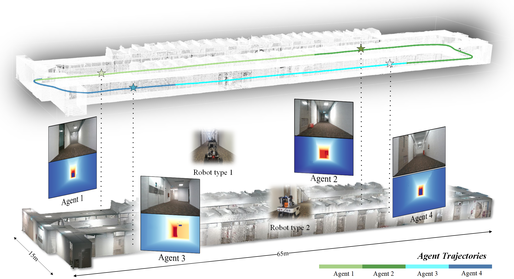
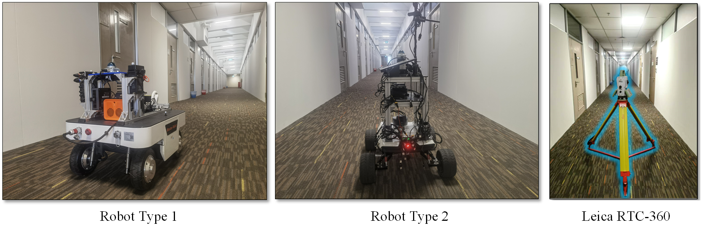
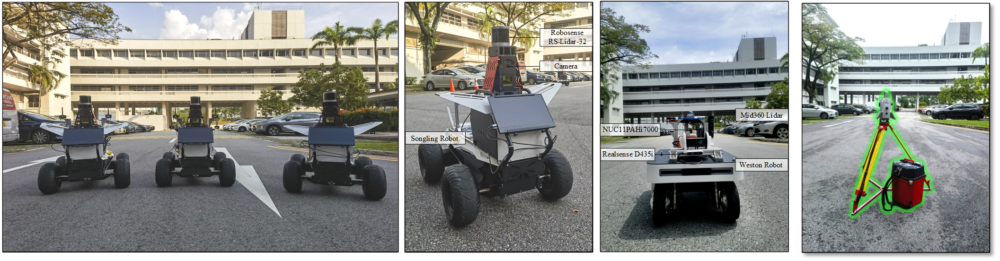

    

# [MCN-SLAM: Multi-Agent Collaborative Neural SLAM with Implicit Neural Scene Representation (Neural Dense SLAM Dataset)](https://dtc111111.github.io/DES-dataset/)

The dataset is collected over large-scale indoor areas, featuring:

* A comprehensive multi-sensor suite:
  + Non-repetitive lidar
  + RGB Camera
  + Depth Camera
  + High quality IMUs
* Multiple Robot Types 
  Indoor
  

    
  

  Outdoor
  

    
  

* High resolution large scale survey-grade indoor prior maps (Indoor)
  

    
    
    
  

* High resolution large scale survey-grade outdoor prior maps (Outdoor)
  

    
  

* Visualization of DES dataset.

    

    

# Notes:
If you have some inquiry, please raise an [issue](https://github.com/dtc111111/DES.github.io/issues) on github.

# Licence
This work is licensed under a [Creative Commons Attribution-NonCommercial-ShareAlike 4.0 International License](https://creativecommons.org/licenses/by-nc-sa/4.0/) and is intended for non-commercial academic use.

# Updates

**23/6/2025**: Partial release.

